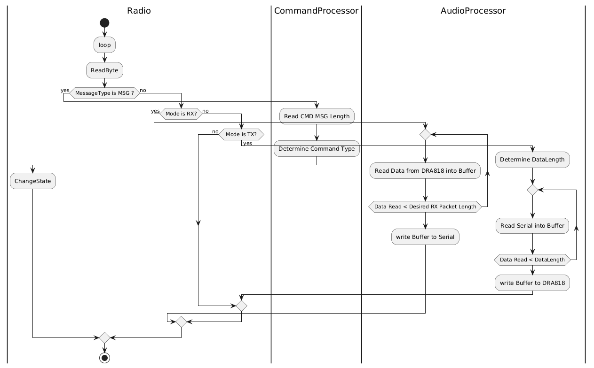

# KV4P-HT - ESP32 Firmware

## Brief

This firmware has been developed for use on the ESP32 as part of the KV4P-HT project.

The goal of this firmware is to only be an interface for the app to send and receive an audio signal to and from the DRA818 module.

## How to Use This Documentation

This documentation will make use of PLantUML diagrams. You can generate these diagrams by using any PlantUML tool such as [planttext.com](https://www.planttext.com/).

## Design

Here is the activity diagram for the ESP32 code:



## Doxygen

You can get class diagrams and technical documentation in Doxygen. Run the following command to generate the documenation:

```bash
doxygen
```
